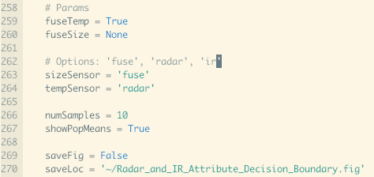

# Naive Bayesian Toy Problem
This project illustrates use of bayesian networks and sensor fusion in context of a toy problem. The problem is to determine the classification of a fictional hostile target and fictional friendly target.

## Setup

1. Clone this repo:
 git clone https://github.com/Homefly/naivebayestoy.git
Navigate to the directory that contains the sample code:

2. cd into installed directory

3. Within a virtualenv, install the dependencies:
  
      pip install -r requirements.txt -t lib

## Run
1. Change params in att_naive_bayes.py for desired sensor configuration.

2. In your virutal enviorment run: python att_naive_bayes.py
